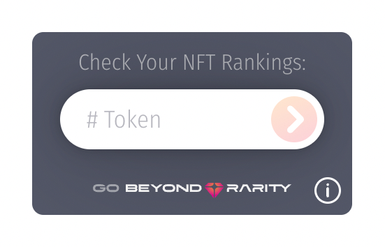

# Beyond Rarity Instacheck Widget - JS Version

<p float="left">
  
  
</p>

<br/>

## Check out the [BR-InstaCheck Widget Live Demo](https://codepen.io/nicopanfili/pen/oNqedza) on CodePen.

<br/>

## Usage

```html
<body>
    .
    .
    .
    <!-- STEP 1: Create the BR-InstaCheck widget within your html and set collectionId, startTokenId and endTokenId values -->
    <div id="br-instacheck" collectionId="wallstmoms" startTokenId="1" endTokenId="3000" theme="light" />
    .
    .
    .

    <!-- STEP 2: Import BR-InstaCheck package from the CDN (at bottom of <body> tag)-->
    <script src="https://cdn.jsdelivr.net/npm/@beyondrarity/instacheck-js@latest/dist/index.min.js"></script>

    <!-- STEP 3: Initialize the BR-InstaCheck after importing the package -->
    <script>
        BRInstacheck.init("#br-instacheck");
    </script>
</body>
```
1. **Create the BR-InstaCheck widget** as a div container element where you want it placed withing your web page. You must set the `id="br-instacheck"` for the BR-InstaCheck package to know where to render the widget.
2. **Import the BR-InstaCheck package** from the CDN at the bottom of your html `<body>` tag. By placing at the end of the body, teh web page can load first and then fetch BR-InstaCheck package.
3. **Initialize the BR-Instacheck widget** after you have imported the package. This will run the BR-InstaCheck code to render the widget.

<br/>

## Attributes

| Attribute      | Description                                                                                                                                                                                                                                                                                                                                                                                                                                                 |            Required             |
| -------------- | :---------------------------------------------------------------------------------------------------------------------------------------------------------------------------------------------------------------------------------------------------------------------------------------------------------------------------------------------------------------------------------------------------------------------------------------------------------- | :-----------------------------: |
| `collectionId` | The Collection Id which is the unique identifier for your collection (also called slug).The Collection Id is available in the URL when navigating to your collection on [Beyond Rarity](https://www.beyondrarity.com) which is in the following format:<br><br>`www.beyondrarity.com/c/[collectionId]`<br><br>For example, the URL for the `Wall St Moms` collection is https://www.beyondrarity.com/c/wallstmoms where `wallstmoms` is the `collectionId`. |              `yes`              |
| `startTokenId` | The first token id in the collection which is normally `1` or `0`.                                                                                                                                                                                                                                                                                                                                                                                          |              `yes`              |
| `endTokenId`   | The last token id in the collection which is normally:<br>- `equal to the supply if the first token id is 1`<br>- `or equal to the (supply - 1) if the first token id is 0`                                                                                                                                                                                                                                                                                 |              `yes`              |
| `theme`        | `"dark"` or `"light"`                                                                                                                                                                                                                                                                                                                                                                                                                                       | `No`.Default value is `"light"` |

<br/>

## Alternative Usage
Instead of specifying the attributes in the `<div id="br-instacheck" ...>` container element, you can specify the attributes as a config object as the second parameter to the `BRInstacheck.init` function.

### Alternate Usage Example
```html
<body>
    .
    .
    .
    <div id="br-instacheck" />
    .
    .
    .

    <script src="https://cdn.jsdelivr.net/npm/@beyondrarity/instacheck-js@latest/dist/index.min.js"></script>

    <script>
        BRInstacheck.init(
          "#br-instacheck",
          {
            collectionId: "wallstmoms",
            startTokenId: 1,
            endTokenId: 3000,
            theme="dark" 
          }
        );
    </script>
</body>
```

`NOTE:` The div container element attributes take precedence over the config object values. If you define an attribute in both the div container and `BRInstacheck.init` config object, the value defined on the div container element will be used.

Check out the [BR-InstaCheck Widget Alternative Code Option Live Demo](https://codepen.io/nicopanfili/pen/xxWXVmb) on CodePen.